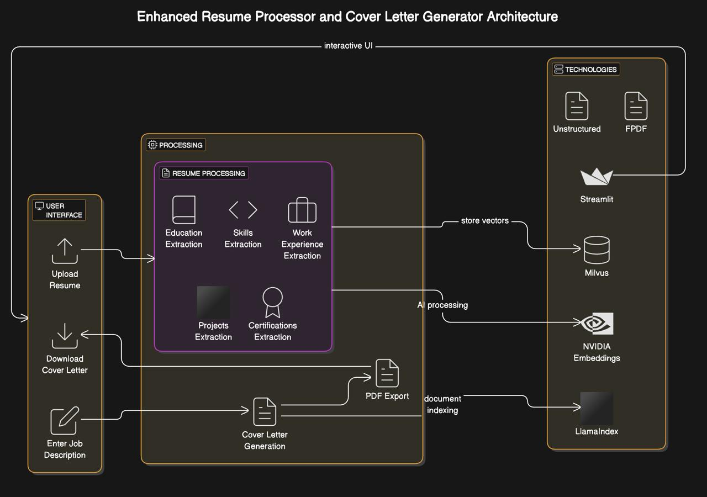
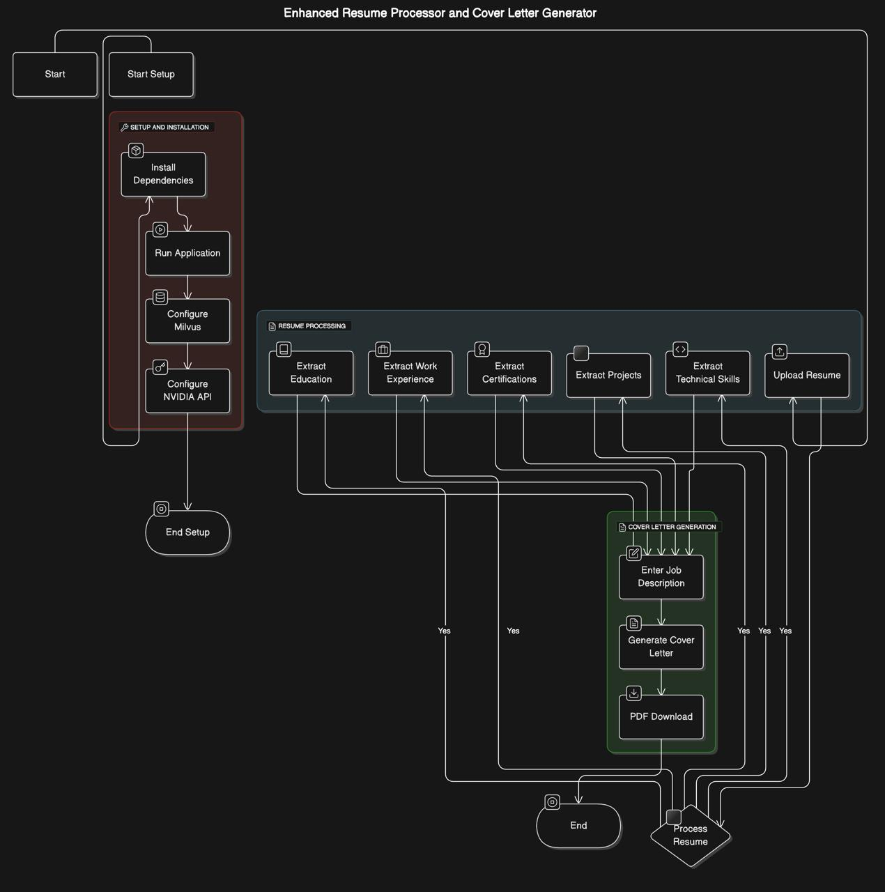

# Enhanced Resume Processor and Cover Letter Generator

This project is an enhanced tool designed to process resumes, extract key information, and generate personalized cover letters based on job descriptions. The application leverages powerful AI models from NVIDIA and integrates with Milvus for efficient vector storage, enabling intelligent document processing and personalized resume analysis.
Here are the shield images in markdown format for each technology:


#### Video Link : [https://drive.google.com/drive/u/0/folders/1pVkceGSH1HdIWBSGZN5zjRkvHQYBjmZO](https://drive.google.com/drive/folders/1pVkceGSH1HdIWBSGZN5zjRkvHQYBjmZO?usp=drive_link)

## Features
- **Resume Processing**: Upload a resume (PDF or DOCX format) and automatically extract key information such as:
  - Education (degree, university, GPA)
  - Work experience (companies, roles, responsibilities)
  - Technical skills
  - Projects
  - Certifications
- **Cover Letter Generation**: Generate a personalized cover letter based on the extracted resume data and a provided job description.
- **PDF Download**: Save the generated cover letter as a PDF, complete with header information (e.g., name, contact details, location, and professional links).

## Technologies Used
- **LlamaIndex**: For advanced document indexing and search, with custom vector stores for fast retrieval.
- **NVIDIA Embeddings**: Using NVIDIA's pre-trained models for embeddings and large language model (LLM) inference.
- **Milvus**: Vector store for storing and searching resume data efficiently.
- **Streamlit**: For building the interactive user interface.
- **Unstructured**: For document partitioning and text extraction.
- **FPDF**: For generating PDF documents.

# Architecture Diagram



## Setup and Installation

To run this project locally, follow these steps:

### Prerequisites
- Python 3.8 or higher
- Install dependencies via `pip`:
  
```bash
pip install -r requirements.txt
```

### Running the Application
To launch the app, run:

```bash
streamlit run app.py
```

This will start the Streamlit server and open the application in your web browser.

### Configuration
Make sure you have Milvus installed and running locally, as it's used for vector store functionality. You can follow the [Milvus installation guide](https://milvus.io/docs/v2.1.0/install_standalone-docker.md) for setup.

You will also need an NVIDIA API key or compatible environment to access NVIDIA models. The app uses NVIDIA’s embedding and LLM models for improved performance.

## Usage

1. **Upload Resume**: Upload a PDF or DOCX file containing the candidate's resume.
2. **Process Resume**: Once the file is uploaded, click "Process Resume" to extract key details.
3. **Enter Job Description**: Input the job description for the role you're applying for.
4. **Generate Cover Letter**: Click "Generate Cover Letter" to create a custom cover letter.
5. **Download Cover Letter**: Once generated, you can download the cover letter as a PDF.

## Functionality Details

### Resume Processing
The tool extracts relevant sections from the resume, including:
- **Education**: Degree, university, graduation year, and GPA.
- **Work Experience**: Companies, roles, key responsibilities, and achievements.
- **Technical Skills**: Programming languages, tools, frameworks, and other competencies.
- **Projects**: Information about notable projects and technologies used.
- **Certifications**: Any relevant certifications.


### Cover Letter Generation
The generated cover letter is based on the extracted resume data and the job description provided. It follows a structured format:
1. **Introduction**: A brief introduction and interest in the role.
2. **Skills and Education**: Matching the candidate's qualifications with the job requirements.
3. **Work Experience**: Key work experiences related to the job.
4. **Projects and Technical Expertise**: Relevant projects showcasing the candidate's skills.
5. **Company Fit**: Why the candidate is a good fit for the company and role.
6. **Closing**: A professional closing and call to action.

### PDF Export
Once the cover letter is generated, you can download it as a PDF file for easy sharing or printing.


# Flowchart 



## Example Use Case

1. **Upload Resume**: John Doe uploads his resume.
2. **Process Resume**: The tool extracts his education (Computer Science, MIT, 2023, GPA 3.8), work experience (Software Developer at TechCorp), skills (Python, JavaScript, TensorFlow), and projects (AI-powered recommendation system).
3. **Enter Job Description**: John inputs the job description for a Data Scientist role at Google.
4. **Generate Cover Letter**: The system generates a personalized cover letter that highlights John's skills, experience, and fit for the Data Scientist role at Google.
5. **Download PDF**: John downloads his cover letter in PDF format.

## Contributing
Feel free to fork this repository and submit pull requests. Contributions, bug reports, and feature requests are welcome.

## License
This project is licensed under the MIT License - see the [LICENSE](LICENSE) file for details.